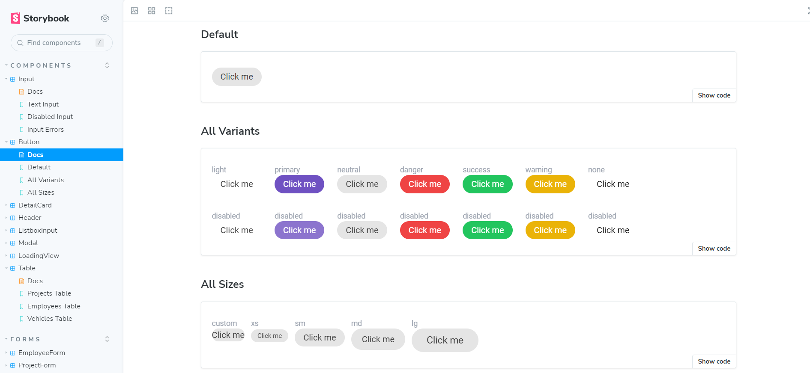

# Buildflow Portal

Buildflow Portal is the front-end part of the Flowise's Buildflow app.

## Installation

To install project, you can follow these steps:

1.  Clone this repository to your local machine using `git clone https://github.com/FlowiseTeam/BuildFlow-portal.git`
2.  Install the required dependencies by running `npm install`
3.  Start the app with _Mirage.js_ by running `npm run dev`
4.  Start the app with _Back-End_ by running `npm run proxy`

## Storybook

Storybook is a frontend workshop environment tool for UI/UX. It allows you to render individual components with different props.



To run storybook, you can follow these steps:

1.  Run `npm run storybook`
2.  Open your browser and go to `http://localhost:6006`

## Technologies Used

- Typescript
- React
- Tailwind CSS
- React-query, React-form-hook
- Vitest, testing-library, Cypress
- Storybook

## Project structure

```
├───.storybook //storybook config
├───assets //deprecated, static assets folder
├───cypress //E2E cypress tests are here
├───public // static assets for Vite shoudl be kept here
└───src
    ├───components //common components should be kept here
    ├───data //json data file should be kept here
    ├───features //all features should be kept here, example project - project components, modals, etc
    ├───hooks //all common hooks, ex. useParams, useToggle
    ├───layouts //common layouts related components should be stored here, ex. notifications, app layout, page layout
    ├───lib //place to use adapter pattern for 3rd party libs. Useful in case of need to replace library with other solution
    ├───mirage //mirage is used to intercept API calls for faster development, see README in that folder
    ├───pages //every app page has its own file here
    ├───services //all api functionality is stored here
```
